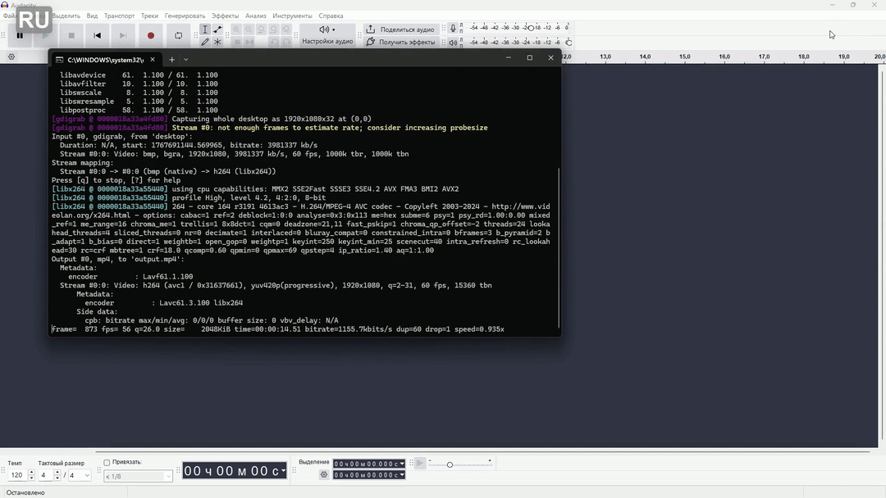

# TabWindSwitcher

`TabWindSwitcher` is a utility for Windows that enhances the standard Alt+Tab window switching experience, bringing a more Linux-like functionality to your desktop. It provides an alternative method for navigating between open applications and their windows.

## Features

-   **Enhanced Alt+Tab replacement:** Replaces the default Windows Alt+Tab overlay with a richer one.
-   **Alt+Tab:** Cycles through **all visible top-level windows** (same as stock Windows Alt+Tab, but with the custom UI).
-   **Alt+~ (Alt + Tilde):** Filters the switcher to show **only the windows of the currently focused application**, so you can pick a specific Notepad/Explorer/etc. window without leaving the app.
-   **Shift+Alt+Tab / Shift+Alt+~:** Cycle backwards through the switcher.
-   **Esc:** Cancel the switcher without changing focus.
-   **Multi‑row layout:** When many windows are open, the switcher automatically arranges icons into multiple rows, keeping the overlay compact and centered on screen. No more horizontal scrolling or off‑screen items.
-   **Pagination:** If the total grid would still overflow vertically, additional rows are paginated and accessible via **PageUp/PageDown** (or **Shift+Tab** past the last window).
-   **DPI‑aware:** The overlay scales correctly on high‑DPI displays.
-   **System tray icon:** Right‑click the tray icon for About / Exit.

## Demonstration



## How it Works

The program intercepts the standard Alt+Tab shortcut and provides its own overlay for window selection. It distinguishes between individual window instances and the current application group, offering two distinct switching modes via `Alt+Tab` (all windows) and `Alt+~` (windows of the current application). Shift inverts the cycling direction; Esc cancels.

## Setup and Configuration

### `TabWindSwitcher.ini`

The `TabWindSwitcher.ini` file, located in the same directory as the executable, can be used to configure various aspects of the program (visual settings, behavior). It allows for personalized adjustments to the switcher's functionality.

Example:

```ini
[Settings]
Transparency=220          ; 0..255 overlay opacity
MinimizeOthers=1          ; 1 = minimize all other windows after switching
BgColorR=40               ; background RGB
BgColorG=40
BgColorB=45
BgColorA=220              ; 0..255 background opacity
SelColorR=120             ; selection rectangle RGB
SelColorG=120
SelColorB=140
SelColorA=80
TextColorR=255
TextColorG=255
TextColorB=255
WindowRadius=12           ; rounded corner radius
SelectionRadius=6         ; selection rectangle corner radius
IconTimeoutMs=50          ; WM_GETICON timeout per window
```

### Autostart with Windows

To have `TabWindSwitcher` launch automatically when Windows starts, you can add a shortcut to your Startup folder:

1.  Press `Win + R` to open the Run dialog.
2.  Type `shell:startup` and press Enter. This will open the Windows Startup folder.
3.  Create a shortcut to `TabWindSwitcher.exe` in this folder. You can do this by right-clicking on `TabWindSwitcher.exe`, selecting "Create shortcut," and then moving the created shortcut into the opened Startup folder.

## Installation and Usage

*(As this is a compiled executable, typical usage would involve running `TabWindSwitcher.exe`. Further installation instructions, if any, would be placed here.)*

## Building from Source

*(Information on how to compile `TabWindSwitcher.cpp` using `build.bat` or other means would be placed here.)*

## Changelog

### 2026‑06‑01
- **Shift+Tab / Shift+~** to cycle backwards.
- **Esc** to cancel the switcher without activating anything.
- **Pagination** for large window counts (PageUp/PageDown).
- **Tray icon** with About / Exit context menu.
- **DPI awareness** — overlay now scales on high‑DPI displays.
- **Background icon loading** — switcher appears immediately; icons stream in as they resolve.
- **QueryFullProcessImageNameW** — also enumerates Protected Process Light (PPL) icons.
- **Class refactor + thread safety** — state encapsulated in `TabWindSwitcherApp`; hook is mutex‑guarded.
- **INI color/radius keys** — full theming via `TabWindSwitcher.ini`.
- **Unit tests** for filter logic.

### 2026‑01‑12
- **Added multi‑row layout** – icons now wrap to multiple rows when there are many windows, preventing the overlay from exceeding screen width.
- **Code cleanup** – streamlined data structures and improved layout calculations.

### 2025‑12‑01
- Initial release with Alt+Tab and Alt+~ switching modes.
- Configurable transparency via INI file.
- Single‑instance enforcement.
